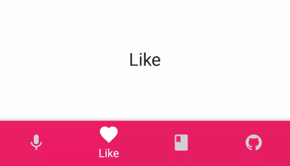
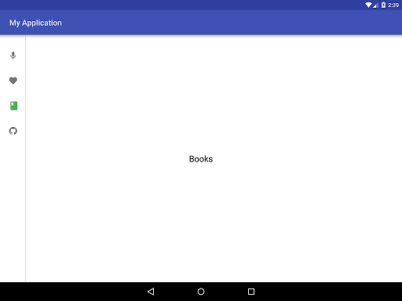
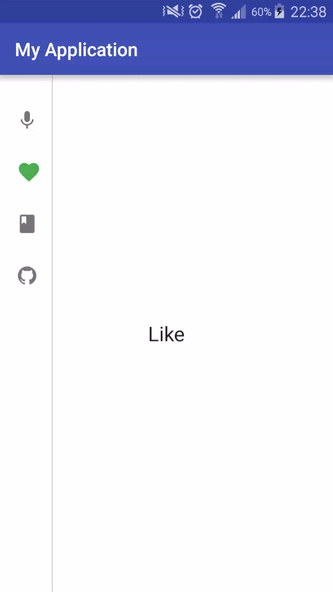
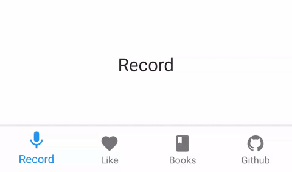

# Material Bottom Navigation
# DEPRECATED
Use offical [Bottom Navigation](https://developer.android.com/reference/android/support/design/widget/BottomNavigationView.html)

[](https://android-arsenal.com/details/1/3337)

BottomNavigationView

Designed according Google [guideLine][1]
[1]: https://www.google.com/design/spec/components/bottom-navigation.html#bottom-navigation-usage
[2]: http://luseen.com/
[3]: http://fir.im/luseen?release_id=56feaea800fc741d61000000
By [Luseen][2] Technologies 

[Download simple apk][3]






Download
--------

Gradle:
```groovy
compile 'com.github.armcha:LuseenBottomNavigation:1.8.2'
```
Maven:
```xml
<dependency>
  <groupId>com.github.armcha</groupId>
  <artifactId>LuseenBottomNavigation</artifactId>
  <version>1.8.2</version>
  <type>pom</type>
</dependency>
```
Usage
-----

Add the BottomNavigationView to your layout

```xml
 <com.luseen.luseenbottomnavigation.BottomNavigation.BottomNavigationView
        android:id="@+id/bottomNavigation"
        android:layout_width="match_parent"
        android:layout_height="wrap_content"
        android:layout_alignParentBottom="true" />
```

Add BottomNavigation items 

```java
  BottomNavigationView bottomNavigationView = (BottomNavigationView) findViewById(R.id.bottomNavigation);
  
   BottomNavigationItem bottomNavigationItem = new BottomNavigationItem
                ("Record", ContextCompat.getColor(this, R.color.firstColor), R.drawable.ic_mic_black_24dp);
   BottomNavigationItem bottomNavigationItem1 = new BottomNavigationItem
                ("Like", ContextCompat.getColor(this, R.color.secondColor), R.drawable.ic_favorite_black_24dp);
  bottomNavigationView.addTab(bottomNavigationItem);
  bottomNavigationView.addTab(bottomNavigationItem1);
```

Then set your `OnBottomNavigationItemClickListener`

```java
 
bottomNavigationView.setOnBottomNavigationItemClickListener(new OnBottomNavigationItemClickListener() {
            @Override
            public void onNavigationItemClick(int index) {
                 Toast.makeText(MainActivity.this, "Item " +index +" clicked", Toast.LENGTH_SHORT).show();
            }
        });
```
If you are using a `ViewPager` , you can connect to the `BottomNavigationView`,
Set color in this way, when using view pager:
  
  ```java
   ContextCompat.getColor(context, R.color.firstColor)
   bottomNavigationView.setUpWithViewPager(yourPager , colorResources , imageResources);
  ```
You can disable slide animation when using viewPager
  ```java
  bottomNavigationView.disableViewPagerSlide();
  ```
  
If your activity/fragment will not recreate and bottom navigation items doubled on orientation change,
just can call this method
     
```java
bottomNavigationView.willNotRecreate(true);
```


Customize
---------

Customize with xml

```xml
  <com.luseen.luseenbottomnavigation.BottomNavigation.BottomNavigationView
         android:id="@+id/bottomNavigation"
         android:layout_width="match_parent"
         android:layout_height="wrap_content"
         android:layout_alignParentBottom="true"
         app:bnv_colored_background="true"
         app:bnv_with_text="false"
         app:bnv_shadow="true"
         app:bnv_tablet="false"
         app:bnv_viewpager_slide="true"
         app:bnv_active_color="@color/colorPrimary"
         app:bnv_active_text_size="@dimen/bottom_navigation_text_size_active"
         app:bnv_inactive_text_size="@dimen/bottom_navigation_text_size_inactive"/>
```

or programmatically


You can activate tablet mode
```java
 bottomNavigationView.activateTabletMode();
```


```java
 bottomNavigationView.isWithText(true);
```

```java
 bottomNavigationView.isColoredBackground(false);
 bottomNavigationView.setItemActiveColorWithoutColoredBackground(yourColor);
```


Change text active or inactive size
```java
  bottomNavigationView.setTextActiveSize(float yoursize);
  bottomNavigationView.setTextInactiveSize(float yoursize);
```

Change tab programmatically
```java
bottomNavigationView.selectTab(int position);
```

You can just disable BottomNavigationView shadow by calling 
```java
 bottomNavigationView.disableShadow();
```
 
You can set your custom font for item text.
assets/fonts/your_font.ttf
```java
 bottomNavigationView.setFont(Typeface.createFromAsset(getApplicationContext().getAssets(), "fonts/your_font.ttf"));
```

## Contact 

Pull requests are more than welcome.

Please fell free to contact me if there is any problem when using the library.

- **email**: armcha01@gmail.com
- **facebook**: https://web.facebook.com/chatikyana
- **website**: http://luseen.com/

License
--------


          Copyright 2016 Arman Chatikyan

      Licensed under the Apache License, Version 2.0 (the "License");
      you may not use this file except in compliance with the License.
      You may obtain a copy of the License at

         http://www.apache.org/licenses/LICENSE-2.0

      Unless required by applicable law or agreed to in writing, software
      distributed under the License is distributed on an "AS IS" BASIS,
      WITHOUT WARRANTIES OR CONDITIONS OF ANY KIND, either express or implied.
      See the License for the specific language governing permissions and
      limitations under the License.
    
